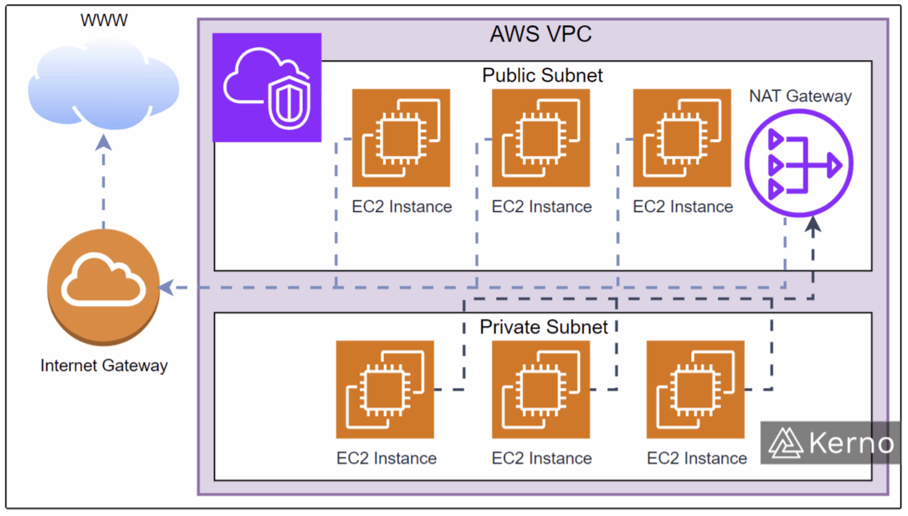

# VPC

## Virtual Private Cloud

- Private network to deploy your resources
- Level: Regional
- When creating an EC2 Instance, a default Public subnet is created. It cannot be Private.

## Subnets

- Partition the network inside of the VPC
- **Route tables**: defining how traffic flows in/out of the subnet
- Level: Availability Zone

### Examples

Within the VPC:

- Public Subnet - accessible from the internet
- Private Subnet - not accessibale from the internet

Source: https://www.kerno.io/learn/what-is-aws-vpc-tutorial

## Internet Gateways

- Helps the VPC Public instances connect to the internet.
- Public subnets have a route to the internet gateway.
- That make it a Public subnet

## NAT Gateways and NAT Instances

- NATs allow your instances to connect to the internet, e.g. to get updates, while remaning Private.
- NAT is Network Address Translation (NAT)
- **NAT Gateways** are AWS managed
- **NAT Instances** are self-managed
- The NAT is deployed in the Public subnet
- The NAT connects to the **Internet Gateway** to access the internet
- The Instances in the Private Subnet connect to the NAT in the Public subnet to access the internet.
- Example of use: This would be required if an EC2 Instance in the private subnet needs to connect to an AWS RDS, EFS, ElastiCache, etc, and it going over the public internet (not using the AWS Network via a VPC Endpoint).

## Network Access Control List (NACL)

This is a firewall that has ALLOW and DENY rules for traffic into the Public subnet.

- Attached at the Subnet level
- Rules:
  - Can be ALLOW/DENY
  - Can be ONLY for IP addresses.
- The Default VPC creates a default NACL that allows all traffic in and out
- Return traffic must be explicitly allowed.

## Security Groups

A firewall that controls traffic to an EC2 Instance or Elastic Network Interface (ENI).

- Return traffic must be automatically allowed.
- Rules:
  - Can ONLY be ALLOW
  - Can be for IP Addresses
  - Can be for other Security Groups.

## VPC Flow Logs

These are logs that capture all network traffic issues.

- Types:

  - VPC Flow logs
  - Subnet Flow logs
  - Elastic Network Interface flow logs

- They can help to troubleshoot convectivity issues between internet -> subnet, subnet -> subnet, subnet -> internet.
- Captures network traffic issues from Managed interface:
  - Elastic Load Balancers, ElastiCache, RDS, Aurora, etc.
- VPC FLow logs can be directed into other services, such as S3, CloudWatch Logs.

## VPC Peering

- VPC Peering allows conectivity between two separate VPCs using AWS's network.
- They act as if there are the same network, so the CIDR ranges of the two VPCs must not be overlapping.
- It is not transitive, meaning that only VPC's directly peered can connect to each other, e.g., VPC 1 is connected to both VPC 2 and VPC 3, does not mean VPC 2 and VPC 3 can connect with each other. The only relationships are VPC 1 to VPC 2, and VPC 1 to VPC 3.

## VPC Endpoints

- When you connect from an EC2 Instance to other AWS Services, e.g., S3 bucket, CloudWatch, etc. It is going over the public internet.
- If you want to connect from your private subnet to other AWS Services over the AWS Network (so not over the internet), you need to use a **VPC Endpoint**. This is more secure, and faster.
- **VPC Endpoint Gateway**: Connects to S3 and DynamoDB
- **VPC Endpoint Network Interface (ENI)**: Connects privately to all other services, e.g. CloudWatch.

## Site to Site VPN

This is for when you want to connect an on-premises VPN to a VPN in AWS. It goes over the public internet but the connection is encrypted.

## Direct Connect (DX)

Direct Connect is when you want an on-premises VPN to a VPN in AWS, but you want a private physical connection that does not go over the internet. It takes some time to setup the physical connection.

## Three-Tier Architecture

The types of VPC and Subnets setup enable a multi-tier architecture:

- Public Subnet: Elastic Load Balancer, and Route 53
- Private Subnet: Auto-scaling group, EC2 Instances
- Data Subnet: RDS, ElasticCache

## Exam Architectures

For the exam, there may be some questions on Architectures.

### LAMP Stack on EC2

- Linux, Apache, MySQL, PHP
- Can add Redis/Memcached (ElastiCache)
- Can store local application data & software on EBS drive (root)

### Wordpress on AWS

Sending an Image using a Wordpress Environment using:

- Route 53
- EC2 Instances in mutliple Availabiliy Zones
- Elastic Network Interface (ENI) to allow communication to store the images on:
- An Elastic File Share (EFS)
